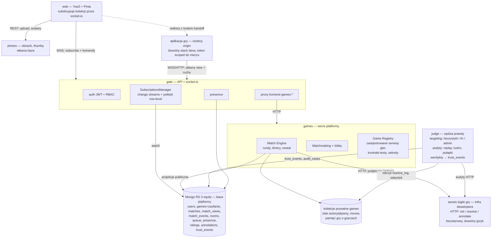
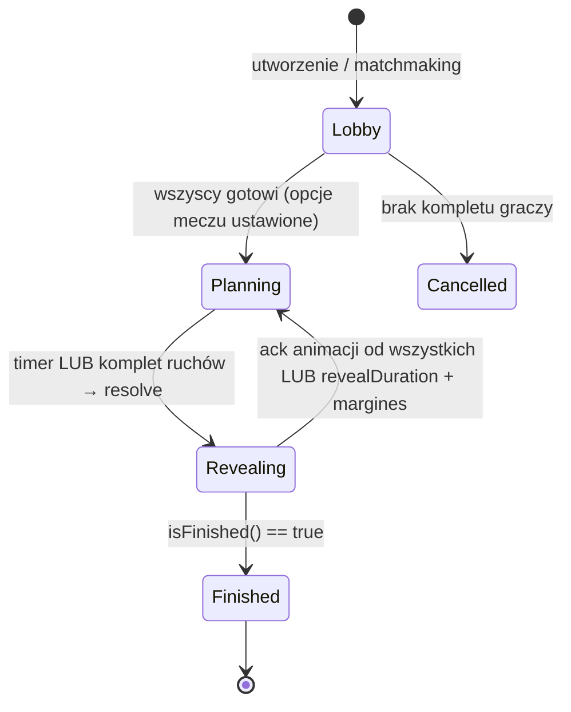
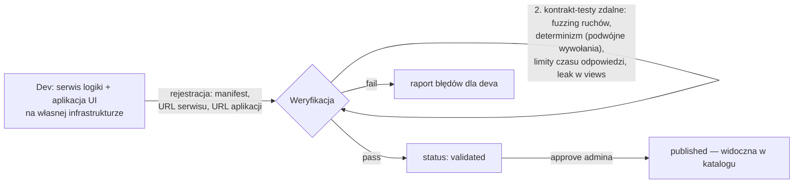

# sixseven — architektura platformy gier turowych (v2, na bazie hydry)

Platforma gier turowych z symultanicznym planowaniem: gracze planują ruch równocześnie (faza ~30 s), serwer ujawnia i rozstrzyga rundę. Gra (logika i UI) żyje **poza platformą, na infrastrukturze dewelopera** — platforma prowadzi mecze, woła logikę gry po HTTP i gwarantuje graczom fair play. Punkt wyjścia: projekt **hydra** (gate + web + image + MongoDB replica set z change streams). Gra referencyjna i tutorial: **arrowsoccer** (`docs/games/ARROWSOCCER.md`).

## Naprawdę trudne problemy

1. **Ukryta informacja w modelu subskrypcji** — gate rozsyła zmiany kolekcji; jeśli ruchy trafią do subskrybowalnego dokumentu, przeciwnik zobaczy je przed reveal. W hydrze dziś autoryzacja subskrypcji jest tylko na poziomie kolekcji, bez row-level — to luka #1 do zamknięcia.
2. **Zależność od zdalnych serwisów gier** — logika gry to serwis dewelopera wołany po HTTP: timeouty, retry, polityka pauzy/anulowania meczu, podpisywanie żądań i strukturalna walidacja odpowiedzi. Serwis, który padł albo kłamie, nie może zepsuć platformy ani unieważnić fair play.
3. **Poprawność silnika tur** — timery, spóźnieni gracze, reconnect, odtwarzanie meczów po restarcie games.

## Usługi



Przepływ danych jest jednokierunkowy: komendy idą web → gate → games (HTTP, synchroniczny ack z błędem walidacji), a stan wraca games → Mongo → change stream → gate → web. Gate nie zna reguł gier; games nie zna socketów.

## Ukryta informacja — rozwiązanie w modelu subskrypcji

Zasada: **games publikuje projekcje, nigdy stan autorytatywny.** Pełny stan meczu i ruchy bieżącej rundy żyją w kolekcjach prywatnych games, których gate w ogóle nie wystawia. Do bazy platformy trafiają tylko:

- `matches` — metadane publiczne: gracze, runda, faza, deadline, punkty, kto już "gotowy" (bez treści ruchów). Subskrypcja: tylko uczestnicy (+ lista otwartych gier bez szczegółów).
- `match_views` — jeden dokument na parę (matchId, playerId) = wynik `viewFor`. Subskrypcja z filtrem wstrzykiwanym przez serwer: `playerId == user._id`. Klient nie może go nadpisać.
- `match_events` — historia rozstrzygniętych rund (po reveal wszystko jest jawne).

Wymaga to zmiany w gate: zamiast hardcoded `collectionPermissions` — **deklaratywna polityka per kolekcja**: `{ collection, requiredPermission?, injectFilter?: (user) => Filter }`. Filtr klienta jest AND-owany z filtrem serwera. To jedna zmiana w `subscribe.handler.ts` + rejestr polityk, a zamyka lukę dla całej platformy.

Dodatkowo: ack "gracz gotowy" publikowany natychmiast po przyjęciu ruchu, żeby timing zapisu nie zdradzał niczego o treści.

## Safe secret — model zaufania

Kluczowa wartość platformy: zaplanowany ruch pozostaje tajny do reveal. Dwóch przeciwników tej tajemnicy:

**Przeciwny gracz** — zablokowany konstrukcyjnie: ruchy żyją w kolekcjach prywatnych games, klient dostaje tylko własny `match_views`, ack „gotowy" nie niesie treści.

**Deweloper gry** — trudniejszy, bo jego kod jest po obu stronach (UI zbiera ruchy, logika je rozstrzyga), a **parowania sesji nie da się zapobiec**: dwie sesje tego samego meczu widzą ten sam stan świata, który jest odciskiem palca meczu. Bronimy więc nie tożsamości meczu, lecz kanałów wycieku — trzema warstwami:

1. **Logika widzi ruchy dopiero po zamknięciu fazy.** Jedyny transfer ruchów do serwisu gry to `/resolve`, po deadline. W trakcie planowania infrastruktura deva nie zna żadnego złożonego ruchu.
2. **Ranked tylko z UI serwowanym przez platformę.** Aplikacja UI zna rysowane ruchy z natury — więc w meczach rankingowych (ELO, szybki mecz) UI musi być statycznym bundlem hostowanym u nas, z CSP: `connect-src` wyłącznie API platformy + blokada WebRTC. Kanał wycieku fizycznie nie istnieje — przeglądarka gracza go blokuje. UI self-hosted = tylko mecze towarzyskie, z etykietą „UI poza platformą" w katalogu.
3. **Detekcja i kary.** Statystyka kontr (gracz trafiający w odpowiedzi na ruchy, których nie mógł znać, odstaje od losowości przy dużej próbie), mecze-pułapki (platforma rozgrywa mecz sterując obiema stronami przez prawdziwą aplikację gry w instrumentowanej przeglądarce i obserwuje, czy do UI wpływają dane skorelowane z „ukrytymi" ruchami), kary od obniżenia health-score po unpublish. Warstwa 3 jest siatką pod warstwami 1–2, nie gwarancją — celowany cheat dla wybranych graczy może omijać pułapki.

## Zaufanie jako waluta platformy

Platforma bazuje na zaufaniu — więc zaufanie jest mierzalną walutą, nie deklaracją. Każda gra ma dwie jawne osie:

- **Renoma** (start: 100%) — ocena uczciwości i jakości. Spada wyłącznie przy działaniu sprzecznym z integralnością platformy: odpowiedź poza schematem, złamany determinizm, niespójność stanu-następnika, timeout seryjny, wykryty przeciek, nadużycie odznak. Waga spadku zależna od ciężaru naruszenia.
- **Sprawdzalność** (start: 0%) — waga dowodowa tej oceny. Rośnie z każdą integralnie niesprzeczną odpowiedzią API, z każdym meczem rozegranym end-to-end na obcych (deweloperskich) serwerach bez niespójności, z każdym przejściem okresowych kontrakt-testów i meczów-pułapek. **Naruszenie też podnosi sprawdzalność** — negatywna obserwacja to również wiedza o grze.

Nowa gra = „niewinna, ale niesprawdzona". Gra po incydencie = „znana i skompromitowana" — to gorszy stan niż nowość, i słusznie. Zaufanie efektywne (do decyzji automatycznych) = renoma ważona sprawdzalnością.

**Co zaufanie kupuje** (progi do kalibracji):

| Przywilej | Wymaganie |
|---|---|
| Obecność w katalogu | renoma > próg minimalny |
| Ranked / szybki mecz | wysoka renoma + niezerowa sprawdzalność + UI bundle z CSP |
| Limit równoległych meczów | rośnie ze sprawdzalnością (nowa gra startuje z małą kwotą) |
| Publikacja nowej wersji bez ręcznego approve | wysoka renoma × wysoka sprawdzalność |
| Rzadsze mecze-pułapki i health-checki | jw. — zaufani kosztują nas mniej |
| Wyróżnienie „sprawdzona" w katalogu | sprawdzalność > próg |

**Mechanika:** append-only `trust_events` (każda obserwacja: źródło, typ, waga) + agregaty na dokumencie gry w kolekcji `games` — publiczne i subskrybowalne, gracze widzą renomę/sprawdzalność w katalogu. Anti-farming: mecze podbijają sprawdzalność z wagą zależną od unikalności i niezależności graczy (stado botów deva grających ze sobą ≈ zero wagi; realni, niepowiązani gracze = pełna).

**Audyty ad hoc, niezapowiedziane — mikroserwis `judge` (sędzia prawdy).** Osobny serwis, bo audyt ma inny rytm niż silnik: asynchroniczny, własny budżet, widok między grami i kontami devów, awaria nie dotyka meczów. Dwie warstwy o twardo rozdzielonych rolach:

- **Targeting (kogo sprawdzić):** heurystyki + opcjonalnie AI (konfigurowalne przez admina: `off` / `assist` — podpowiada adminowi / `auto` — sam alokuje budżet audytów) + ręczne zlecenia admina. Sygnały: anomalie win-rate, statystyka kontr, wzorce czasowe, grafy powiązanych kont, historia trust_events dewelopera.
- **Werdykty (czy winny):** wyłącznie deterministyczne dowody z audytów. **AI wybiera cele, nigdy nie ferruje wyroków** — kara wymaga twardego, powtarzalnego dowodu; targeting decyduje tylko o tym, gdzie patrzymy.

Sędzia prowadzi `audit_cases` (dossier per gra i per konto deweloperskie) i emituje werdykty jako `trust_events`. Bezstanowość i determinizm serwisów logiki czynią audyt prawie darmowym, więc odbywa się losowo i bez ostrzeżenia, nieodróżnialnie od ruchu produkcyjnego:

- **Replay-audit** — platforma trzyma wejście/wyjście każdego `/resolve`; ponowne wysłanie historycznego żądania musi dać identyczną odpowiedź. Wykrywa złamany determinizm i cichą podmianę logiki. **Werdykt „replay niezgodny" wymaga zgodności wersji manifestu** między oryginałem a powtórką: legalna zmiana wersji ma prawo dać inny wynik, więc replay porównuje tylko w obrębie tej samej wersji (patrz „Wersjonowanie" i wersja w `/resolve`). *(C3)*
- **Test lustrzany** — historyczny stan z zamienionymi graczami musi dać lustrzany wynik. Wykrywa logikę faworyzującą konkretnego gracza, bez znajomości reguł gry.
- **Mecze-pułapki** — jak w „Safe secret": platforma gra obiema stronami przez instrumentowaną aplikację UI.

Wyniki audytów agregują się **per gra i per konto deweloperskie** — wzorce naruszeń w wielu grach jednego deva są widoczne jako całość i obciążają wszystkie jego gry.

**Rozstrzygnięte:** renoma odbudowuje się czystą kartoteką powoli i asymptotycznie, nigdy do 100% po incydencie; nowa gra dziedziczy renomę konta deweloperskiego (+ bonus startowy sprawdzalności) — oszust nie resetuje się nową grą. Formuły i progi: `docs/IMPLEMENTATION_PLAN.md`.

## Przepływ rundy



Faza `Revealing` istnieje dla gier, których reveal to animacja (fizyka, przebieg zderzeń): `resolve` zwraca `revealDurationMs`, klienci po odtworzeniu wysyłają `reveal-done`, a silnik startuje kolejne planowanie po komplecie acków albo po `revealDuration + margines` — klient, który nie odpowiada, nie blokuje meczu.

```mermaid
sequenceDiagram
    participant A as Gracz A (aplikacja gry)
    participant G as gate
    participant E as games
    participant S as serwis gry (HTTP, infra deva)
    participant M as Mongo RS

    E->>M: matches.phase=planning, match_views (viewFor każdego)
    M-->>G: change stream
    G-->>A: collection-update (tylko własny view)
    A->>G: games:submit-move
    G->>E: HTTP POST /matches/:id/moves (user z JWT)
    Note over E: tylko walidacja strukturalna (schemat, rozmiar) —<br/>ruch NIE opuszcza platformy przed końcem fazy
    E->>M: matches: ready[A]=true (ruch zostaje w bazie prywatnej)
    Note over E: deadline LUB komplet ruchów — faza zamknięta
    E->>S: POST /resolve (stan + surowe ruchy + lista spóźnionych + wersja manifestu, podpisane)
    S-->>E: nowy stan, punkty, events, views, finished, revealDurationMs
    E->>M: match_events.insert, matches.update, match_views.update × N
    M-->>G: change streams → reveal u wszystkich graczy
    Note over A,E: klienci animują reveal → reveal-done;<br/>komplet acków LUB revealDuration+margines → nowa faza planowania
```

## Kontrakt gry (SDK)

Bez zmian koncepcyjnych względem v1 — gra to czyste funkcje, zero I/O:

```ts
interface GameDefinition<State, Move, View> {
  // meta (id, gracze, czas fazy) i schemat opcji meczu żyją w game.config.json
  init(playerIds: string[], seed: number,
       playerData: Record<string, { data?: Data; prefs?: Prefs }>,
       options: Options): State;                         // options: host w lobby, wg schematu z manifestu
  validateMove(state, playerId, move: unknown): move is Move;
  defaultMove(state, playerId, rng: Rng): Move;          // timeout/disconnect
  resolve(state, moves: Record<string, Move>): { state; points; events;
    revealDurationMs?: number };                         // ile trwa animacja reveal u klientów
  isFinished(state): { finished: boolean; winnerIds?: string[] };
  viewFor(state, playerId): View;                        // ukryta informacja
}
```

Kontrakt ma dwie postaci: **funkcje** (SDK TypeScript — dev implementuje `GameDefinition`, a `sixseven-sdk serve` opakowuje go w serwis HTTP) i **wire contract** (HTTP z podpisanymi żądaniami — dla dowolnego języka). Silnik minimalizuje round-tripy: jedna runda = jeden `POST /resolve` (stan + surowe ruchy + lista spóźnionych + **wersja manifestu, z którą mecz wystartował** → nowy stan, punkty, events, widoki per gracz, finished, revealDurationMs). Wersja jest zapisywana w `resolve_log`; dzięki niej dev wie, którą wersją logiki obsłużyć stan, a replay-audit nie generuje fałszywych pozytywów po legalnej zmianie wersji. Każda próba retry niesie **świeży podpis** (nowy timestamp) i to samo `(matchId, round)` jako klucz idempotencji. Serwis gry jest **bezstanowy** — cały stan trzyma i przekazuje platforma. *(C3, A4)*

Zasada „safe secret" w wire contract: **żaden ruch nie opuszcza platformy przed zamknięciem fazy planowania** — dlatego nie ma zdalnego `/validate-move` w trakcie planowania. W fazie planowania platforma waliduje tylko strukturalnie (JSON, rozmiar); `validateMove` z SDK jest wywoływane przez adapter `serve` wewnątrz `/resolve` — nielegalny ruch dostaje `defaultMove`, co gra raportuje w `events`. UI waliduje lokalnie dla UX (zna reguły).

Pełne developer experience: `docs/GAME_DEV_GUIDE.md`; implementacja referencyjna i tutorial: arrowsoccer.

## Dostarczanie gier przez deweloperów

Gra żyje w całości na infrastrukturze dewelopera: serwis logiki (HTTP) + aplikacja UI (origin gry). Platforma niczego nie hostuje ani nie wykonuje — rejestruje, weryfikuje i woła.



- **Zaufanie i podpisy:** przy rejestracji gra dostaje sekret; silnik podpisuje każde żądanie (HMAC + timestamp), serwis gry weryfikuje. Odpowiedzi walidowane strukturalnie (schema, limity rozmiaru stanu/eventów) — serwis gry nie może wstrzyknąć niczego poza kontraktem.
- **Wersjonowanie:** manifest deklaruje `version`; zmiany niekompatybilne (schemat opcji, odznaki) wymagają ponownej weryfikacji. Kompatybilność logiki w trakcie trwających meczów to odpowiedzialność deva — stan wraca do niego przy każdym wywołaniu, więc musi umieć przyjąć stan z wcześniejszej wersji logiki. **Każde `/resolve` niesie wersję, z którą mecz wystartował** (mecz jest przypięty do swojej wersji), a `resolve_log` ją zapisuje — bez tego replay-audit dawałby fałszywe pozytywy po legalnej publikacji nowej wersji. *(C3)*
- **Determinizm jako wymóg kontraktu:** ten sam stan + ruchy + seed → ten sam wynik. Weryfikowany kontrakt-testami (podwójne wywołania); replay meczu odtwarzamy z zapisanych wyników rund w `match_events`, nie przez ponowne wykonanie.
- **Kontrakt-testy identyczne lokalnie i przy rejestracji:** `sixseven-sdk test` uderza w lokalnie uruchomiony serwis tym samym harnessem, którym platforma weryfikuje przy rejestracji i okresowo (health-check + re-test po zmianie wersji).

## Znajdowanie współgraczy

Wszystkie trzy tryby kończą się utworzeniem meczu w games; listy są "za darmo" realtime dzięki subskrypcjom kolekcji:

- **Szybki mecz:** kolekcja `queue` (wpis per oczekujący gracz per gra); games dobiera przy komplecie `minPlayers`, później wg ratingu z rozszerzającym się oknem.
- **Lobby/pokoje:** kolekcja `rooms` — publiczne (subskrybowalna lista) i prywatne (kod/link `sixseven.gg/r/AB3X`, działa dla gościa z tymczasowym nickiem). Host ustawia opcje meczu wg schematu z manifestu gry (presety + zakresy); lobby renderuje je generycznie, `init` dostaje wynik.
- **Społeczność:** znajomi, rating ELO per gra, historia (`match_events`), czat w lobby/meczu (nieużywana kolekcja `messages` z hydry to gotowy zalążek), adnotacje gier na profilach (odznaki/tytuły przyznawane przez gry — patrz decyzja niżej).
- **Presence:** gate zna cykl życia socketów — pisze do kolekcji `presence` (status, lastSeen, currentMatchId); klienci subskrybują. W hydrze presence nie istnieje — do zbudowania.

## Frontend (web) — na fundamencie hydry

Warstwa web hydry jest w całości do wzięcia: system slotów layoutu, dark/light mode, biblioteka kontrolek, silnik animacji i wzorzec store'ów z subskrypcjami.

**System slotów.** `AppLayout` wystawia 9 regionów jako named RouterView: `intro`, `subintro`, `submenu`, `messages`, `sidebar`, `header`, `default`, `aside`, `footer`. Trasa wypełnia regiony mapą `components`, animacje per slot sterowane przez `meta.animation` (maszyna stanów w `route-slot.class.ts`). Mapowanie ekranów platformy:

| Ekran | intro | submenu | sidebar | default | aside | messages |
|---|---|---|---|---|---|---|
| Katalog gier | baner | — | znajomi/presence | siatka gier | szczegóły gry | — |
| Gra (hub) | nagłówek gry | graj / pokoje / ranking / zasady | znajomi | zależnie od zakładki | szczegóły pokoju | — |
| Powrót z meczu | — | — | — | wynik, rewanż, historia rund | gracze | — |
| Profil/społeczność | nagłówek | zakładki | — | treść | — | — |

Slot `aside` (36rem) jako szczegóły pokoju na listach — wzorzec `engine-detail` z hydry. **Sam mecz nie ma ekranu w web** — wejście w grę przekierowuje do zewnętrznej aplikacji gry (patrz decyzja o UI gier); web wita gracza z powrotem ekranem wyniku (dane z `match_events`) z opcją rewanżu.

**Motyw.** CSS variables generowane z SCSS, klasa `light`/`dark` na `<html>`, fallback do `prefers-color-scheme`. UI gier dostaje te same tokeny (`--background-color`, `--primary-color`, `--success/error-color`...), więc gry z automatu respektują motyw. Znany bug: wybór motywu czyta `hydra-theme` z localStorage, ale nigdy go nie zapisuje — toggle nie przeżywa reloadu; poprawka jednolinijkowa.

**Kontrolki do wzięcia:** komplet formularzy (`UiInput/Number/Select/Multiselect/Autocomplete/ChipInput/Switch/Checkbox/Radio`), `UiPopup` (modal z focus trapem i blokadą scrolla), `UiMessage`, `UiProgress` (już spięty ze stanem socketa), `UiLoader`, `UiButton`, `UiSaveIndicator`, transitions (`fade`, `slide-*`, `roll3d-*` — roll3d idealny do reveal kart), `useDropdown` (pozycjonowanie + pełna nawigacja klawiaturą), `usePermission`, tooltips z floating-vue.

**Do zbudowania (luki):**

- Toast manager (kolejka, auto-dismiss) — `UiMessage` jest tylko inline; teleport target `#popups` to gotowy wzorzec.
- Responsywność mobilna — w całym CSS są tylko 2 media queries (oba `prefers-color-scheme`); layout jest desktopowy ze sztywnymi panelami 20/36rem. Katalog, lobby i czat muszą działać na telefonie.
- Skala tokenów `--space-*` / typografii — dziś hardcoded em/rem; tokeny motywu wystawiamy też aplikacjom gier (endpoint z JSON-em kolorów).
- Czat (lobby/znajomi), przepływ przekierowania do gry i powrotu (handoff z kodem, ekran wyniku, rewanż).
- Generyczny `useCollection(name, filter)` — wyciągnięcie boilerplate'u powielanego dziś w każdym store.

## Awarie i nadużycia

- **Brak ruchu / rozłączenie** → `defaultMove`; grace period do końca następnej rundy, reconnect odtwarza stan z `match_views` (init snapshot subskrypcji). Porzucenie ranked = walkower + kara ratingu.
- **Restart games** → stan autorytatywny zapisywany po każdej rundzie w bazie prywatnej; na boot: skan aktywnych meczów, wznowienie timerów, restart bieżącej nierozstrzygniętej rundy.
- **Restart gate** → klienci mają reconnect + resubscribe (wzorzec już w hydrze); `collection-init` daje świeży snapshot.
- **Oszustwa graczy** → serwer autorytatywny, walidacja strukturalna przy złożeniu + walidacja gry w `/resolve`, cudze ruchy nigdy nie opuszczają platformy przed zamknięciem fazy.
- **Oszustwa dewelopera gry** → trójwarstwowy model „Safe secret" (sekcja wyżej): ruchy po zamknięciu fazy, ranked tylko z UI na platformie (CSP), detekcja statystyczna + mecze-pułapki.
- **Utrata zmian streamu** (gate padł w trakcie) → snapshot na resubscribe naprawia stan klienta; games nie zależy od streamów do poprawności, tylko do fan-outu.
- **Serwis gry nie odpowiada** → timeout (budżet z kontraktu) + retry z backoffem; runda czeka, gracze widzą status „gra chwilowo niedostępna". Po N próbach mecz zapauzowany, po dłuższym oknie anulowany **bez zmian ratingu**. Każdy taki incydent to `trust_event`: renoma w dół, sprawdzalność w górę; przewlekła niedostępność = spadek poniżej progu katalogu (unpublish) do czasu naprawy.
- **Serwis gry odpowiada śmieciami** → walidacja schematu i limitów (rozmiar stanu, eventów, liczba odznak) przy każdej odpowiedzi; niepoprawna odpowiedź traktowana jak brak odpowiedzi.

## Co bierzemy z hydry, co zmieniamy, co wycinamy

**Zostaje bez zmian:** auth JWT z handshake i rewokacją, RBAC z dziedziczeniem ról (`sync-users.service`), silnik subskrypcji change streams, framework handlerów socketowych z rate-limitem, replica set w docker-compose, fundament web (gate store, wzorzec store'ów, biblioteka `Ui*`, guardy, testy z `socket-simulator`). Photos (image) — zostaje jako serwis avatarów i assetów gier.

**Do zmiany:**
- **Row-level autoryzacja subskrypcji** (luka #1) — deklaratywne polityki z wstrzykiwanym filtrem zamiast hardcoded mapy.
- **Tokeny scoped do meczu** — handoff kod→token dla aplikacji gier; gate honoruje zawężone uprawnienia (tylko własny view + ruchy w jednym meczu) obok pełnych JWT użytkowników.
- Wyciągnięcie powielanego boilerplate'u store'ów do generycznego `useCollection(name, filter)`.
- `cfg/` → zwykłe `.env` per serwis (gate już tak działa); rotacja hardcoded `JWT_SECRET` (jest w docker-compose!), wymóg env w image.
- Reseed ról/uprawnień pod domenę gier.
- Multi-device: dedupe ticketów po `collection+filter` per user gubi drugą kartę/urządzenie — zweryfikować i naprawić przed oparciem się na `match_views`.

**Wycinamy:** engines/clusters, projects (boards, datasets, playlisty, studio, concepts, color-presets), seedy `unreal`/`ue-*`, martwy katalog `new/`, stub REST 501. To pozostałości po pierwotnej domenie (sterowanie Unreal Engine w studiu TV).

## Decyzje

### MongoDB replica set + change streams zamiast Postgres
**Why:** Hydra już to ma i działa; change streams dają fan-out stanu do klientów bez osobnej warstwy pub/sub; jeden mechanizm dla list lobby, presence i meczów.
**What:** Baza platformy (subskrybowalna przez gate) + kolekcje prywatne games (stan, ruchy, pamięć gier). `match_events` jako append-only historia daje replay i odtwarzanie.
**Watch out:** Dopasowywanie filtrów jest in-process w gate — skalowanie gate na wiele instancji wymaga wpięcia `@socket.io/mongo-adapter` (już w zależnościach) i przemyślenia fan-outu streamów. Mongo nie jest kolejką — komendy idą HTTP, nie przez bazę.

### Mikroserwisy wg podziału hydry (gate/web/photos/games)
**Why:** Podział już istnieje i jest zdrowy: gate = transport i autoryzacja, games = domena. Nie płacimy kosztu projektowania granic od zera.
**What:** Games jako nowy serwis wzorem image (własny katalog, Dockerfile, wpis w compose); komunikacja gate→games po HTTP.
**Watch out:** Nie mnożyć serwisów dalej — matchmaking i registry to moduły w games, nie osobne deploye. Wyjątek z powodem: `judge` (audyt ma inny rytm, budżet i domenę awarii niż silnik meczów — patrz „Zaufanie").

### Logika gry jako zdalny serwis dewelopera (silnik u nas, wykonanie u nich)
**Why:** Kod gier jest z definicji niezaufany — zamiast izolować go u siebie (sandbox: duży koszt, wieczny wyścig zbrojeń), nie wykonujemy go wcale. Osobna infrastruktura = ta sama filozofia co przy UI (osobny origin). Bonus: dowolny język, znika pipeline bundli, a fair play zostaje u nas — silnik dalej prowadzi fazy, timery i ukrywa ruchy.
**What:** Serwis gry to bezstanowe HTTP (wire contract; SDK TS z `sixseven-sdk serve` jako wygodna implementacja). Silnik podpisuje żądania (HMAC + sekret z rejestracji), waliduje odpowiedzi strukturalnie z limitami rozmiaru, woła jedną zbatchowaną operacją per runda. Rejestracja gry = manifest + URL-e + zdalne kontrakt-testy + approve.
**Watch out:** (1) Dostępność serwisu gry to teraz dostępność meczu — patrz „Awarie". (2) Determinizmu nie wymusimy technicznie, tylko kontrakt-testami — replay z zapisanych wyników, nie z ponownego wykonania. (3) Serwis gry widzi wszystkie ruchy (jest arbitrem) — to OK wobec graczy, ale wyniki wpływają na ELO tylko w obrębie tej gry, więc nieuczciwy dev psuje wyłącznie własny ranking. (4) Latencja per runda = 1 round-trip do deva — budżet w kontrakcie (np. 2 s), egzekwowany timeoutem.

### Komendy przez HTTP, stan przez change streams
**Why:** Gracz musi natychmiast wiedzieć, że ruch odrzucono (walidacja); round-trip przez bazę i stream dodaje lag i gubi kontekst błędu.
**What:** gate proxuje `games:*` do games po HTTP i zwraca ack/błąd; cały fan-out stanu wyłącznie przez subskrypcje.
**Watch out:** Dwie ścieżki = dwa źródła prawdy u klienta; UI traktuje ack tylko jako potwierdzenie przyjęcia, renderuje zawsze ze streamu.

### Model sesji: wielotokenowy (minimalny)
**Why:** Hydra trzyma pojedyncze `users.token` — logowanie na drugim urządzeniu nadpisuje token i po cichu wylogowuje pierwsze. Platforma ma presence, znajomych i handoff do aplikacji gier, więc gracz realnie bywa na web (desktop) i aplikacji gry (telefon) naraz; jednosesyjność by to psuła. Lista sesji jest znacznie tańsza do zbudowania teraz niż migracja później (Etap 1 i tak dotykał tokenów).
**What:** `users.token: String` → `users.sessions: [{ token/jti, device?, createdAt, lastSeen }]`. Middleware auth dopasowuje token do dowolnej aktywnej sesji (`findOne({ _id, 'sessions.token': token })`), login **dokłada** sesję zamiast nadpisywać, logout usuwa bieżącą sesję, plus akcja „wyloguj wszędzie" czyszcząca listę. Rewokacja pozostaje DB-backed, ale per sesja.
**Watch out:** (1) Bez limitu lista sesji rośnie — TTL/prune nieużywanych (np. `lastSeen` starsze niż TTL JWT = 7 dni) i górny limit sesji per user. (2) Pełne zarządzanie w UI (lista urządzeń, „wyloguj wybrane") świadomie odłożone po MVP — teraz tylko model + „wyloguj wszędzie". (3) Zmiana schematu = migracja istniejących `token` → jednoelementowe `sessions`. *(realizacja w Etapie 1/2 przy tokenach)*

### UI gry jako zewnętrzna aplikacja z dostępem do API (nie sandbox w DOM platformy)
**Why:** Deweloper dostarcza produkt end-to-end. Izolację najlepiej daje osobny origin — przeglądarka pilnuje granicy za darmo, znika cały problem XSS, renderera i mostków. Ukrytej informacji UI nie musi chronić (klient i tak dostaje tylko własny `match_views`).
**What:** Gra widoczna w katalogu platformy; wejście w mecz = przekierowanie do aplikacji gry (osobny origin) z jednorazowym kodem w URL. Aplikacja wymienia kod na **token scoped do meczu** (ten gracz, ten mecz, uprawnienia: subskrypcja własnego widoku + składanie ruchów, TTL do końca meczu) i rozmawia z gate jak każdy klient. Dev pisze w dowolnej technologii.
**Watch out:** (1) Scoped tokeny to warunek bezwzględny — pełny JWT użytkownika w aplikacji gry = dev widzi czat, znajomych i cudze mecze. (2) Aplikacja gry sama rysuje timer, graczy i wynik — dane ma w `matches`, ale spójności UX nie wymusimy, jedynie podamy tokeny motywu. (3) Granica phishingu: gra nigdy nie prosi o hasło platformy — do komunikowania graczom i egzekwowania w regulaminie. (4) Hosting UI ma **dwa poziomy zaufania** (patrz „Safe secret"): ranked wymaga bundle'a serwowanego przez platformę z CSP; self-hosted = tylko mecze towarzyskie, z etykietą. Logika zawsze na infrastrukturze deva. Ewentualne osadzenie w slocie `default` jako opcja później.

### Wabiki (równoległe sztuczne mecze, rotacja ID) — rozważone i odrzucone
**Why:** Pomysł na zmydlenie parowania sesji: na każdy prawdziwy mecz platforma uruchamia dodatkowo sztuczne mecze i rotuje identyfikatorami, by dev nie wiedział, które sesje należą do prawdziwej pary.
**What (dlaczego nie działa):** (1) Serwis logiki jest bezstanowy i grupuje wywołania po zawartości stanu, nie po ID — a jeśli stany wabików sklonujemy z prawdziwego meczu, demaskuje je test następnika: tylko prawdziwe ruchy produkują stan kolejnej rundy. (2) Sztucznych ruchów nie umie generować platforma (musiałyby być wiarygodne w konkretnej grze — to umie tylko jej dev), a sztuczne sesje UI zdradzają się ciągłością połączenia, cookies i datacenter IP; po pierwszym reveal jawne ruchy wskazują prawdziwą sesję na resztę meczu. (3) Nawet skuteczna niejednoznaczność 1-z-N przecieka wartość (oszust ocenia wszystkie kandydatury) i mnoży koszty (N× `/resolve` na infrastrukturze deva, N× stan u nas).
**Watch out:** Rdzeń pomysłu przeżył w odwróconej roli — sesje syntetyczne jako **mecze-pułapki** w warstwie detekcji (patrz „Safe secret").

### Adnotacje graczy per gra: pula z manifestu + pamięć gry w kolekcjach prywatnych
**Why:** Gry mają dopisywać rzeczy o graczach („Niezwyciężony piłkarz", „Łamaga w RPS") bez ryzyka konfliktów między grami i bez niezaufanego tekstu na publicznych profilach.
**What:** Dwie warstwy. (1) **Pamięć gry** per (gracz, gra) w kolekcjach prywatnych games, niewidoczna dla nikogo poza grą, dostarczana do `init` przy każdym nowym meczu. Ma dwa obszary o różnych właścicielach zapisu: `data` — akumulator logiki (serie, bilans, rywalizacje), pisany wyłącznie przez hook `annotate` po meczu; `prefs` — preferencje gracza (domyślny ruch, ustawienie zawodników), pisane przez aplikację gry przez API (scoped token, tylko własny gracz), obowiązują od następnego meczu. Silnik snapshotuje `playerData` przy starcie meczu (jak seed) — replay pozostaje deterministyczny. (2) **Odznaki** — pula tytułów zadeklarowana w `game.config.json` z oznaczeniem `sentiment`, moderowana raz przy publish; w runtime gra tylko przyznaje/odbiera (`grant`/`revoke`) przez `annotate(finalState, prevData)`. Kolekcja `annotations`: dokument per przyznana odznaka `{playerId, gameId, badgeId, params, sentiment, earnedAt}`. Scope wymusza silnik — gra pisze wyłącznie pod własnym `gameId`, kolizje niemożliwe konstrukcyjnie.
**Watch out:** (1) Widoczność: pozytywne publiczne, pozostałe tylko dla właściciela — polityka subskrypcji z filtrem `sentiment=='positive' OR playerId==user._id`; ten sam warunek musi egzekwować REST/profil, nie tylko subskrypcje. (2) Limity: pamięć gry ≤ 4 KB per gracz, `/annotate` pod tym samym reżimem (podpis, timeout, walidacja odpowiedzi) co `/resolve`. (3) `revoke` konieczny od dnia 1 („niezwyciężony" przestaje być niezwyciężony) — bez niego odznaki staną się martwe.

## Portfolio gier na start

| Gra | Rola | Poziom tutoriala |
|---|---|---|
| **Papier, kamień, nożyce** | pierwsza gra (etap 2 MVP), przykład w całym przewodniku | easy — logika mieści się na jednym ekranie |
| **arrowsoccer** | flagowiec, implementacja referencyjna (etap 5) | zaawansowany — fizyka, opcje meczu, prefs, odznaki, reveal z animacją |
| **Pojedynek snajperów** | gra krótkoturowa: obaj celują w tajemnicy 3–5 s, symultaniczny reveal, strzały padają jednocześnie | średni — test dolnej granicy czasu tury i obciążenia silnika |

Granica gatunku: platforma świadomie **nie jest** silnikiem real-time. Obieg rundy (seal → podpisany HTTP do zdalnej logiki → Mongo → change stream → WS) ma minimum rzędu setek milisekund — to cena za safe secret i zdalną logikę. Gry projektujemy wokół napięcia tajnych decyzji, nie refleksu; manifest ma wymuszone `planningPhaseMs ≥ 2000` (walidacja przy rejestracji), a krótkoturowe gry typu snajperzy wyznaczają praktyczny dół tego zakresu.

## Otwarte pytania

- Multi-device dedupe subskrypcji w hydrze — bug do potwierdzenia testem.
- Czy photos przechodzi na wspólny replica set, czy zostaje na osobnym mongo? (dziś osobny, bez change streams — dla obrazków to OK)
- Mobile: responsywność layoutu hydry to realna praca (brak breakpointów) — web responsywny wystarczy, czy planujemy coś więcej?
- Budżet czasu odpowiedzi serwisu gry (propozycja: 2 s na /resolve, 500 ms na /validate-move) i dokładna polityka pauzy/anulowania — do zgrania z revealDuration.
- Osadzenie aplikacji gry w slocie `default` (cross-origin, bez mostka) jako opcja obok fullscreen — kiedykolwiek?
- Czy platforma oferuje kiedyś hosting „managed" (bundle zamiast serwisu) jako łatwiejszą ścieżkę wejścia dla devów bez infrastruktury? Wróciłby wtedy sandbox — świadomie po MVP, jeśli będzie popyt.

## Plan MVP (kolejność)

> Wersja szczegółowa z logiką biznesową, formułami zaufania, maszyną stanów i kryteriami akceptacji: **`docs/IMPLEMENTATION_PLAN.md`** (etapy 0–6).

1. **Fundament z hydry:** wycięcie domeny studia (engines/projects/concepts w gate i web), row-level polityki subskrypcji, rotacja sekretów, `useCollection`, fix persystencji motywu.
2. **Rdzeń games + handoff:** silnik tur wołający zdalny serwis (podpisy, timeouty, walidacja odpowiedzi) + SDK z `sixseven-sdk serve` + RPS jako pierwsza kompletna zewnętrzna gra (serwis + aplikacja UI), pokój przez link, `matches`/`match_views`/`match_events` end-to-end, tokeny scoped + przekierowanie i powrót z wynikiem. Weryfikuje ukrytą informację, model UI i zdalną logikę od razu.
3. **Matchmaking + presence:** kolejka, lista pokoi, statusy online, toast manager.
4. **Społeczność:** znajomi, ELO, historia, czat w lobby (slot `aside`), adnotacje.
5. **Rejestracja gier self-service + silnik zaufania:** formularz/CLI rejestracji, zdalne kontrakt-testy, approve, health-check, `trust_events` z agregatami renomy/sprawdzalności i progami przywilejów. **Arrowsoccer budowany tą ścieżką jako implementacja referencyjna i tutorial** — dokument projektowy gry staje się treścią tutoriala.
