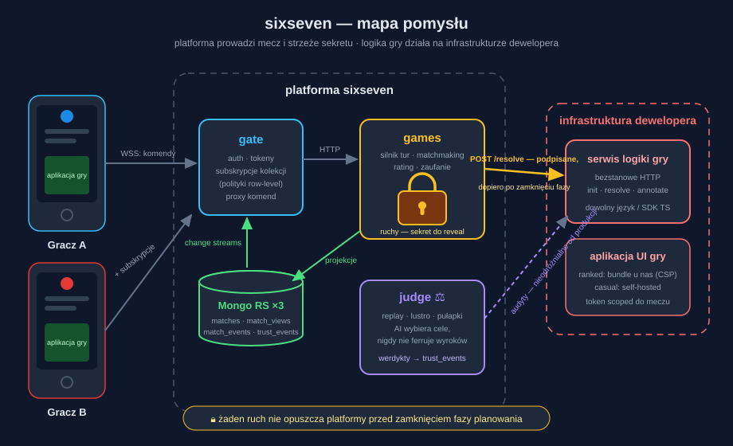

# sixseven

Platforma gier turowych z symultanicznym planowaniem ruchów: wszyscy gracze planują w tajemnicy, potem następuje wspólny reveal. Gry tworzą zewnętrzni deweloperzy i hostują je na własnej infrastrukturze; sixseven prowadzi mecze, matchmaking i społeczność.

**Waluta platformy to sekret.** sixseven jest powiernikiem zaplanowanych ruchów — gwarantuje, że nikt (ani przeciwnik, ani twórca gry) nie pozna ich przed czasem. Zaufanie deweloperów (renoma × sprawdzalność) jest mierzalne, publiczne i kupuje przywileje.

**Status: faza projektowa.** Kod jeszcze nie powstał; dokumentacja poniżej definiuje, jak platforma ma działać — łącznie z tym, czego jeszcze nie wiemy (`docs/UNKNOWNS.md`).

## Mapa dokumentacji

| Dokument | Co zawiera | Dla kogo |
|---|---|---|
| [`docs/HOW_IT_WORKS.md`](docs/HOW_IT_WORKS.md) | jak działa platforma: mecze, sekret, zaufanie, goście | wszyscy — zacznij tu |
| [`ARCHITECTURE.md`](ARCHITECTURE.md) | architektura, decyzje (ADR), model bezpieczeństwa i zaufania | zespół |
| [`docs/IMPLEMENTATION_PLAN.md`](docs/IMPLEMENTATION_PLAN.md) | plan główny: cykl życia sekretu, logika biznesowa, etapy 0–6 | zespół |
| [`docs/GAME_DEV_GUIDE.md`](docs/GAME_DEV_GUIDE.md) | rejestracja, tworzenie i zarządzanie grą (spec SDK i DX) | deweloperzy gier |
| [`docs/UNKNOWNS.md`](docs/UNKNOWNS.md) | rejestr niewiedzy: otwarte pytania i kiedy je rozstrzygamy | zespół |
| [`docs/IMPLEMENTATION_RISKS.md`](docs/IMPLEMENTATION_RISKS.md) | ryzyka implementacyjne: problem → wytyczna, per etap | zespół |
| [`docs/services/`](docs/services/) | rola i plan implementacji każdego elementu systemu | zespół |
| [`docs/games/ARROWSOCCER.md`](docs/games/ARROWSOCCER.md) | flagowa gra i tutorial zaawansowany | zespół, potem devowie |

## Elementy systemu

| Element | Rola w zdaniu | Dokument |
|---|---|---|
| **gate** | jedyna brama klientów: tożsamość, tokeny i subskrypcje kolekcji na change streams | [`docs/services/gate.md`](docs/services/gate.md) |
| **games** | serce: silnik meczów, matchmaking, rating, adnotacje, agregaty zaufania | [`docs/services/games.md`](docs/services/games.md) |
| **judge** | sędzia prawdy: audyty integralności (replay, lustro, pułapki) i dossier podejrzeń | [`docs/services/judge.md`](docs/services/judge.md) |
| **web** | interfejs platformy (Vue3): katalog, lobby, profile, panel admina | [`docs/services/web.md`](docs/services/web.md) |
| **photos** | avatary i grafiki gier (thumby) | [`docs/services/photos.md`](docs/services/photos.md) |
| **sdk** | kontrakt gry: typy, wire contract, CLI, harness testów | [`docs/services/sdk.md`](docs/services/sdk.md) |
| *serwis logiki gry* | infrastruktura dewelopera — bezstanowe HTTP wołane przez games | [`docs/GAME_DEV_GUIDE.md`](docs/GAME_DEV_GUIDE.md) |
| *aplikacja UI gry* | frontend gry dewelopera (self-hosted lub zaufany bundle z CSP) | [`docs/GAME_DEV_GUIDE.md`](docs/GAME_DEV_GUIDE.md) |

Fundament kodu: projekt **hydra** (gate + web + image + MongoDB replica set z change streams) — co bierzemy, a co wycinamy: sekcj